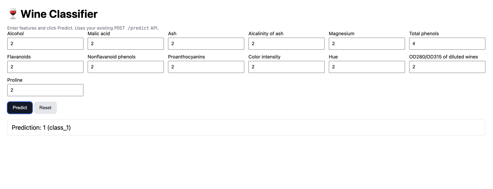

# 🍷 Wine Classifier (FastAPI + Dashboard)

## 📌 Overview
This project is a FastAPI application that exposes a **DecisionTree Classifier** trained on the **Wine dataset** from `scikit-learn`.  

It provides:
- A REST API endpoint `/predict` for predictions  
- A simple dashboard (`/dashboard`) where users can enter all 13 Wine features and see the prediction in real time  

---

## 🔄 Changes Made
1. **Dataset update**  
   - Original lab used the Iris dataset.  
   - Replaced it with the **Wine dataset** (`load_wine` from `scikit-learn`).  

2. **Model saving**  
   - Model is now stored in `model/wine_model.pkl` instead of `iris_model.pkl`.  
   - Training process (DecisionTree Classifier) remains unchanged.  

3. **API schema (`main.py`)**  
   - Pydantic model updated to include all **13 Wine features**.  
   - `/predict` endpoint adjusted to accept these fields.  

4. **Dashboard (`static/index.html`)**  
   - Added a web-based UI served at `/dashboard`.  
   - Users can enter **all 13 features** in a form.  
   - Removed the old 4-feature preset → only the full 13-feature Wine option remains.  
   - Displays prediction result directly on the page.  

---

## ▶️ How to Run

### Retrain the model (if needed)
```bash
cd src
python train.py


Access the app

Health check → http://127.0.0.1:8000/

API docs → http://127.0.0.1:8000/docs

Dashboard → http://127.0.0.1:8000/dashboard

## 🖼️ Result

Here’s the dashboard in action with a sample prediction:


